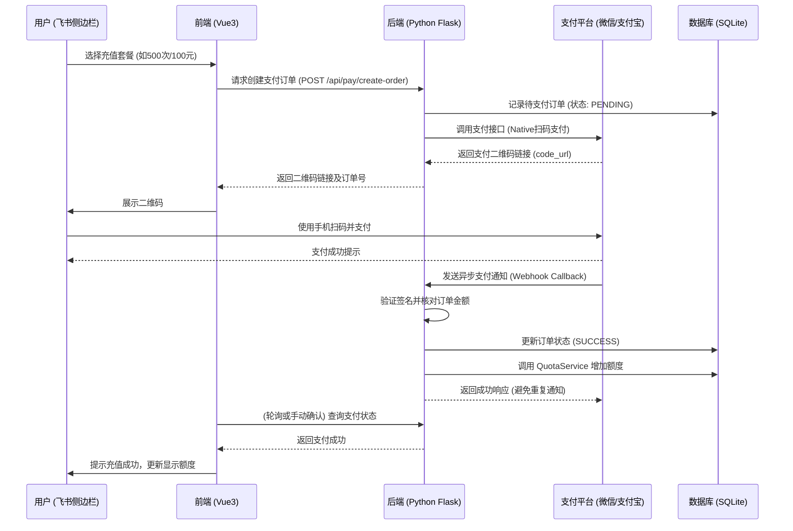

# 微信及支付宝支付集成技术方案

本文档旨在详细描述如何在现有“飞书电子签名插件”中集成微信支付与支付宝支付功能，支持用户扫码充值并自动增加使用额度。

## 1. 业务流程设计

### 1.1 扫码支付全链路


## 2. 技术选型

### 2.1 支付接口模式
- **微信支付**: 采用 **Native 支付** (扫码支付) 模式。
- **支付宝**: 采用 **当面付 - 扫码支付** 模式。
- **资金去向**: 支付成功后，资金将进入商户号对应的资金账户，通过支付平台的自动结算功能打入绑定的**银行卡**。

### 2.2 推荐集成方案
由于涉及两种支付方式，建议使用以下两种方式之一：
1. **直接集成 (推荐)**: 分别集成 `alipay-sdk-python` 和 `wechatpay-python`。
2. **三方聚合支付**: 如使用聚合平台（如 Ping++、EasyPay 等），可以简化为一个接口。

*注：本方案以【直接集成】为基础进行后续设计。*

## 3. 后端详细设计

### 3.1 数据库结构变更
需要在 `quota.db` 中增加 `payment_orders` 表，用于追踪支付情况：
```sql
CREATE TABLE IF NOT EXISTS payment_orders (
    order_id TEXT PRIMARY KEY,
    tenant_key TEXT,
    out_trade_no TEXT,        -- 商户订单号
    pay_type TEXT,            -- 'wechat' 或 'alipay'
    amount REAL,              -- 支付金额
    added_quota INTEGER,      -- 包含额度
    status TEXT,              -- 'PENDING', 'SUCCESS', 'FAILED'
    transaction_id TEXT,      -- 支付平台流水号
    created_at TIMESTAMP,
    updated_at TIMESTAMP
);
```

### 3.2 核心服务类设计
1. **`AlipayService`**: 封装支付宝初始化、下单、异步通知解析、退款（可选）。
2. **`WechatPayService`**: 封装微信支付初始化、V3 证书管理、Native 下单、回调验证。
3. **`PaymentManager`**: 统一调度层，根据前端传参选择支付通道。

### 3.3 新增 API 路由
- `POST /api/pay/unified-order`: 统一创建订单接口。
- `POST /api/pay/alipay-notify`: 支付宝异步回调。
- `POST /api/pay/wechat-notify`: 微信支付异步回调。
- `GET /api/pay/order-status`: 查询订单支付状态。

## 4. 前端详细设计

### 4.1 充值页面 (RechargePanel.vue)
- 设计卡片式套餐选择界面。
- 增加支付平台选择（微信/支付宝图标）。
- 弹窗展示生成的二维码（使用 `qrcode.vue` 库）。

### 4.2 支付反馈逻辑
- 用户支付后，前端通过 `setInterval` 每 3 秒查询一次后端状态。
- 如果检测到成功，展示烟花动效或成功提示，并刷新当前的配额数值。

## 5. 安全性考虑
1. **签名验证**: 所有回调必须验证支付平台的公钥签名。
2. **金额核对**: 回调时必须核对支付平台的金额字段与本地订单字段是否完全匹配。
3. **幂等性**: 处理回调时，先检查订单是否已更新为 SUCCESS，防止由于支付平台重试导致的重复加次数。
4. **超时处理**: 订单 30 分钟不支付自动失效。

## 6. 后续实施步骤建议

1. **准备工作**: 申请微信支付服务号商户、支付宝企业账号或个体户当面付权限。
2. **环境配置**: 在 `.env` 中添加商户 ID、私钥、证书路径等。
3. **后端开发**: 实现支付 Service 和回调接口。
4. **前端开发**: 对接支付流程 UI。
5. **联调测试**: 使用支付宝沙箱环境或微信支付小额真实测试。

---
**讨论点**:
- 确定是否使用个人收款、个体户还是公司主体？（这决定了接口权限）
- 是否需要支持退款功能？
- 结算频次（T+1 还是自动提现）？
