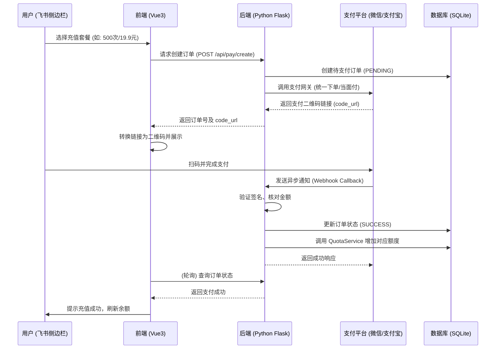

# 微信/支付宝支付接入技术方案 (WeChat & Alipay Integration Plan)

本文档旨在详述如何在现有的“飞书电子签名插件”中正式接入微信支付和支付宝支付，取代目前的模拟充值流程，实现真实的资金到账（银行卡）及配额自动核销。

---

## 1. 核心业务流程 (Core Business Workflow)

### 1.1 支付全链路流程图


---

## 2. 支付接口模式说明

### 2.1 资金结算 (Settlement)
*   **微信支付 (Native Pay)**: 用户扫码后，资金直接进入微信支付商户号，商户号绑定的银行卡可选择 T+1 或手动提现。
*   **支付宝 (当面付)**: 个人转账或企业当面付，资金进入支付宝余额，可自动或手动结算至对应的银行卡。

### 2.2 技术选型
*   **支付宝**: 使用 `alipay-sdk-python`，接入“当面付”接口。
*   **微信支付**: 使用 `wechatpay-python` (V3版)，接入“Native 支付”接口。

---

## 3. 后端详细设计 (Backend Design)

### 3.1 数据库结构更新 (New Table: `payment_orders`)
在 `quota.db` 中新增表，记录每笔支付的来龙去脉。
```sql
CREATE TABLE payment_orders (
    order_id TEXT PRIMARY KEY,    -- 商户内部唯一订单号 (如: ORD20240407...)
    tenant_key TEXT,              -- 飞书租户标识 (关键: 确保加对人)
    package_name TEXT,            -- 套餐名称
    pay_type TEXT,                -- 'wechat' 或 'alipay'
    amount REAL,                  -- 支付金额 (元)
    added_quota INTEGER,          -- 对应的增加次数
    status TEXT,                  -- 'PENDING' (待付), 'SUCCESS' (成功), 'FAILED' (失败)
    transaction_id TEXT,          -- 微信/支付宝的官方交易流水号
    created_at TIMESTAMP,
    updated_at TIMESTAMP
);
```

### 3.2 抽象层设计 (`PaymentService`)
*   **`create_order(tenant_key, plan_id, pay_type)`**: 
    1.  本地存入 `PENDING` 订单。
    2.  调用对应支付 SDK 获取扫码链接。
*   **`handle_callback(pay_type, raw_data, headers)`**:
    1.  验签 (验证数据确实来自支付平台，防止被伪造)。
    2.  核对金额 (防止用户篡改金额)。
    3.  调用 `quota_service.recharge_quota`。
    4.  处理幂等性 (即使支付平台多次发送通知，也只加一次额度)。

---

## 4. 前端详细设计 (Front-end Design)

### 4.1 UI 交互增强
*   **套餐选择**: 在 `ConfigPanel.vue` 中点击套餐后，弹出支付方式选择（微信/支付宝）。
*   **真码显示**: 替换现有的静态二维码图片，动态生成二维码（使用 `qrcode.vue` 库）。
*   **状态反馈**: 
    *   取消目前的 `setTimeout` 自动成功逻辑。
    *   实现 **轮询机制**: 前端每隔 3 秒调用 `GET /api/pay/status/<order_id>`。
    *   若检测到成功，关闭弹窗并更新 UI。

### 4.2 鉴权与租户锁定
*   在飞书侧边栏环境中，通过 `bitable.bridge.getTenantKey()` 锁定身份，确保“谁付钱，谁受益”。

---

## 5. 安全性考量 (Security Checklist)

1.  **回调验证**: 微信使用证书验签，支付宝使用公钥验签。
2.  **金额二次校验**: 回调中的金额必须等于数据库记录的预设金额。
3.  **HTTPS 强制**: 回调接口必须部署在公网且启用 HTTPS。
4.  **订单有效期**: 设置订单 30 分钟不支付自动失效，防止数据库堆积。

---

## 6. 环境准备与物料明细 (Preparation & Requirements)

接入真实支付需要您在对应的支付平台完成实名认证并获取以下关键参数，请根据下表进行准备。

### 6.1 微信支付 (WeChat Pay V3)
| 参数项 | 获取途径 | 说明 | 
| :--- | :--- | :--- |
| **微信商户号 (MCH_ID)** | 微信支付商户平台 -> 账户中心 -> 商户信息 | 必选，用于接收资金的唯一商户标识 |
| **商户 APIV3 密钥** | 微信支付商户平台 -> 账户中心 -> API安全 | 必选，用于加解密回调通知 |
| **商户 API 证书 (apiclient_cert.pem)** | 微信支付商户平台 -> 账户中心 -> API安全 | 必选，用于请求接口身份认证 |
| **商户 API 私钥 (apiclient_key.pem)** | 微信支付商户平台 -> 账户中心 -> API安全 | 必选，用于签名请求 |
| **服务号/小程序 APPID** | 微信公众平台 -> 设置 -> 基本设置 | 必选，用于绑定商户号进行支付 |
| **支付回调域名 (HTTPS)** | 自行准备公网域名 | 必须备案且支持 HTTPS 协议 |

### 6.2 支付宝 (Alipay)
| 参数项 | 获取途径 | 说明 | 
| :--- | :--- | :--- |
| **支付宝 APP_ID** | 支付宝开放平台 -> 控制台 -> 应用 | 必选，创建“当面付”应用后获得 |
| **应用私钥 (APP_PRIVATE_KEY)** | 使用支付宝开发助手生成 | 必选，用于签名请求数据 |
| **支付宝公钥 (ALIPAY_PUBLIC_KEY)** | 支付宝开放平台 -> 接口加签方式 | 必选，用于验证支付宝回调签名 |
| **商户 PID** | 支付宝开放平台 -> 账户中心 -> 商户信息 | 用于结算及退款追踪 |
| **支付宝根证书/公钥证书** | 支付宝开放平台 -> 接口加签方式 | 若使用证书模式（更安全）则需要 |

---

## 7. 配置文件项 (.env 建议)

在后端的 `.env` 中，我们需要补充以下环境变量（请勿将这些值提交至代码仓库）：

```bash
# === 微信支付配置 ===
WECHAT_MCH_ID=您的商户号
WECHAT_API_V3_KEY=您的V3密钥
WECHAT_CERT_PATH=certs/apiclient_cert.pem
WECHAT_KEY_PATH=certs/apiclient_key.pem
WECHAT_APP_ID=您的公众号或小程序APPID
WECHAT_NOTIFY_URL=https://您的域名/api/pay/wechat-notify

# === 支付宝配置 ===
ALIPAY_APP_ID=您的支付宝AppID
ALIPAY_PRIVATE_KEY="您的私钥内容"
ALIPAY_PUBLIC_KEY="支付宝公钥内容"
ALIPAY_NOTIFY_URL=https://您的域名/api/pay/alipay-notify
ALIPAY_DEBUG=true  # 沙箱测试时设为 true
```

---

## 8. 下一步行动 (Next Steps)
1.  **确认本方案**: 确认支付产品类型及资金流向。
2.  **后端实现**: 补充 `payment_orders` 数据表及核心 Service 代码。
3.  **前端对接**: 修改 `ConfigPanel.vue` 中的充值点击逻辑。

---

## 8. 接入实操指南 (Implementation Guide)

### 8.1 微信支付注册入口
- 微信支付商户平台: https://pay.weixin.qq.com/
- 微信公众平台（获取 AppID）: https://mp.weixin.qq.com/

### 8.2 支付宝注册入口
- 支付宝开放平台: https://open.alipay.com/
- 支付宝开发者中心（获取密钥）: https://opendocs.alipay.com/common/02ki6w

### 8.3 其他有用工具
- frp 官方文档: https://github.com/fatedier/frp
- qrcode.vue: https://github.com/scholtz/qrcode.vue

---

*注: 本文件由 AI 自动生成，用于技术方案讨论。*
